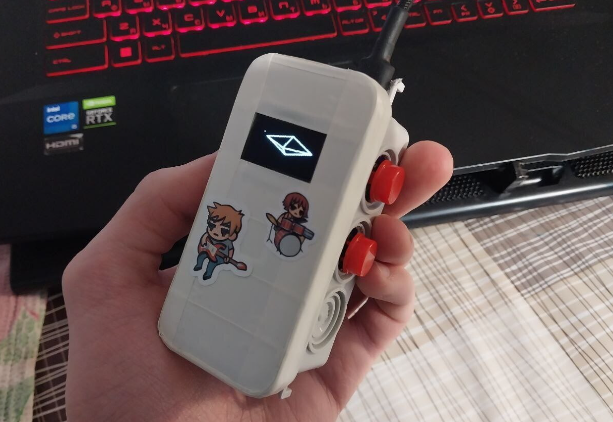
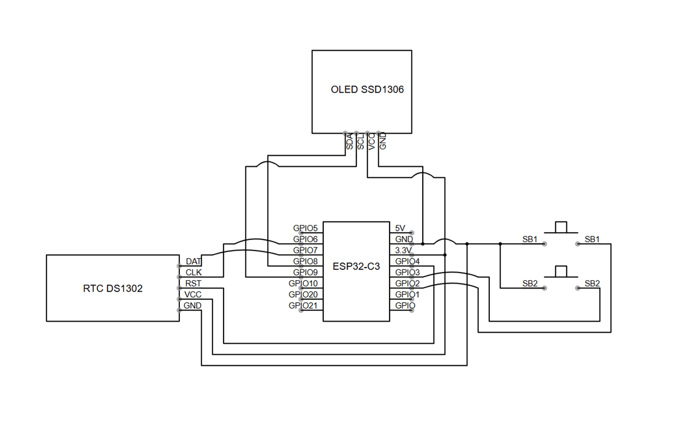

# ESP32-C3 Stopwatch/Clock/3D Animation

**A multifunctional IoT project combining stopwatch, real-time clock, and 3D starfield animation**



---

## 📌 Description

This project features a versatile ESP32-C3-based device that seamlessly integrates three distinct functionalities:

1. **Stopwatch Mode**: Track precise timing intervals with start/pause/reset capabilities.
2. **Real-Time Clock Mode**: Displays accurate time using the DS1302 Real-Time Clock module.
3. **3D Starfield Animation Mode**: Enjoy immersive visuals with a rotating spaceship model against a dynamic starry background.

All user interfaces are presented in Russian language, making this project ideal for Russian-speaking users and educational purposes.

---

## ⚙️ Hardware Requirements

To build this project, you will need the following components:

- **Microcontroller**: ESP32-C3 development board
- **Display**: SSD1306 OLED display (I²C interface)
- **RTC Module**: DS1302 Real-Time Clock module
- **User Interface**: Two tactile push-button switches
- **Power Supply**: USB-C cable for programming and power delivery

---

## 🔧 Software Dependencies

Before compiling and uploading the code, ensure these libraries are installed through the Arduino IDE Library Manager:

```cpp
#include <U8g2lib.h>      // OLED display driver
#include <ThreeWire.h>     // DS1302 communication protocol
#include <RtcDS1302.h>     // RTC functionality implementation
```

---

## 🛠️ Wiring Diagram

Connect your hardware according to the following pin assignments:

| Component          | ESP32-C3 Pins       |
|--------------------|---------------------|
| OLED SCL           | GPIO 9              |
| OLED SDA           | GPIO 8              |
| DS1302 CLK         | GPIO 6              |
| DS1302 DAT         | GPIO 7              |
| DS1302 RST         | GPIO 4              |
| BUTTON 1           | GPIO 2 (Pull-up)    |
| BUTTON 2           | GPIO 3 (Pull-up)    |

---

## 💻 Installation Instructions

Follow these steps to set up and run the project:

1. Install the required libraries mentioned above.
2. Open the provided `stopwatch.ino` sketch in Arduino IDE.
3. Configure your board settings for ESP32-C3.
4. Upload the sketch to your microcontroller.
5. Connect external peripherals as specified in the wiring diagram.
6. Power on the device and navigate through available modes using the buttons.

---

## 📜 License

This project is released under the permissive **MIT License**, allowing free use, modification, and distribution while retaining original copyright notices.


---

Thank you for exploring this innovative ESP32-C3 project! We hope you'll find it both useful and inspiring for your own creative endeavors.
